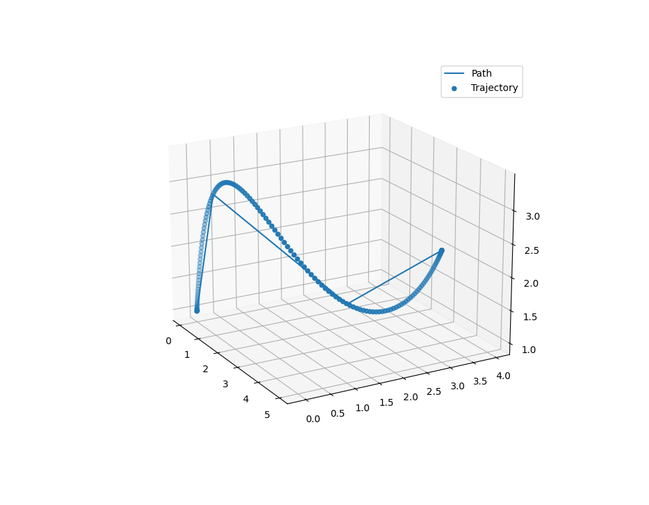

# Generate trajectory through waypoints
A minimum snap trajectory generator. The segment times between consecutive waypoints are also optimised.
```bibtex
@INPROCEEDINGS{5980409,
  author={Mellinger, Daniel and Kumar, Vijay},
  booktitle={2011 IEEE International Conference on Robotics and Automation}, 
  title={Minimum snap trajectory generation and control for quadrotors}, 
  year={2011},
  volume={},
  number={},
  pages={2520-2525},
  doi={10.1109/ICRA.2011.5980409}}
```

